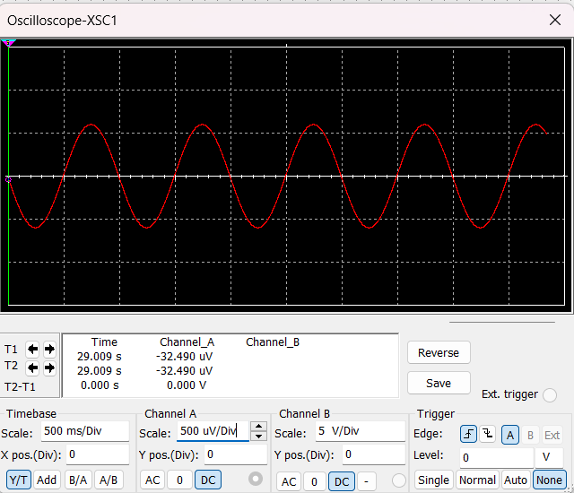
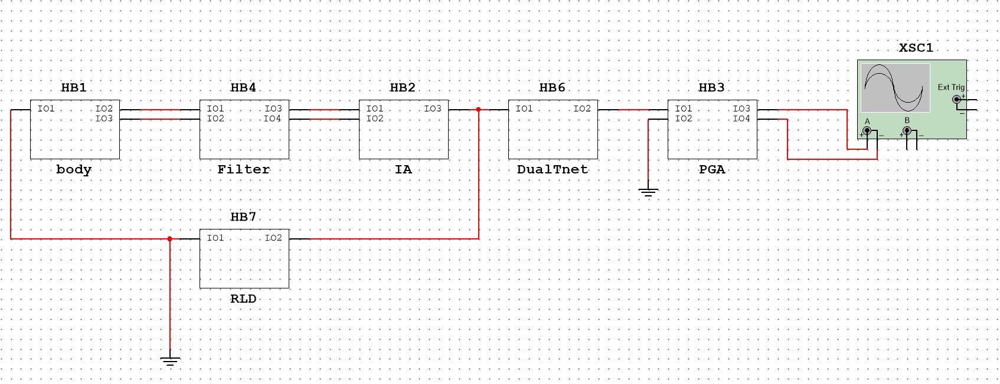

# 引言

## ECG电路简介

心电图（Electrocardiogram，简称ECG）在医学诊断中扮演着重要的角色，可以提供关于心脏功能、心律和心肌病变的信息。它是一项安全、无创且经济的检查方法，被广泛应用于心脏疾病的诊断、监测和治疗过程中。ECG电路是一种用于测量和记录心电信号，以提供医学诊断和监测所需的信息的电路系统。

## ECG技术的发展

早期的ECG设备使用的是低精度和弱稳定性的热电偶和金属薄膜来记录心电信号，这些设备受环境和运动的干扰较大。随着半导体技术的发展，ECG设备逐步采用了集成电路和数字信号处理技术，使得设备更加小型化、便携化和高精度化。

下面是ECG电路发展过程中的一些突出改变：

1.  早期模拟信号处理：最早的ECG设备使用模拟电路来放大和滤波心电信号。模拟滤波器可以去除噪声，并突出特定频率范围内的信号。

2.  发展为数字信号处理：随着计算机技术的进步，数字信号处理在ECG电路中的应用变得普遍。通过将模拟信号转换为数字信号，并使用数字滤波器、快速傅里叶变换等算法进行处理，可以提高信号的质量和提取更多的信息。

3.  设备的集成：随着集成电路技术的发展，ECG设备变得更加小型化和便携化。现在，人们可以使用便携式ECG设备进行随时随地的监测，例如智能手表或可穿戴设备。上述设备中通常将ECG与PPG技术相结合，发展为更加全面的健康检测系统。

4.  增加无线传输功能：传统的ECG设备通常需要通过使用导线将信号传输到记录仪或显示器。现代ECG设备发展出了无线传输技术，通过蓝牙或Wi-Fi将信号实时传输到移动设备或云端，实现远程监护和数据共享。

5.  健康监测和人工智能：随着健康监测和人工智能技术的兴起，ECG也开始与这些技术结合。通过使用机器学习和深度学习算法，可以对大量的心电数据进行分析和诊断，帮助医生进行疾病预测和早期诊断。

ECG电路的发展经历了从模拟信号处理到数字信号处理、从大型设备到便携设备、从有线传输到无线传输的演变。这些进步使得ECG技术更加精确、便捷和可靠，为心脏疾病的诊断和监护提供了更好的工具和方法。

## 电路组成及各部分作用

ECG电路由多个组成部分组成，包括传感器、前置放大器、滤波器、模数转换器和数据处理单元等。

{width="4.90625in"
height="1.78125in"}

图片来源：RICHTEK：《ECG/PPG量测解决方案》

### 传感器（Sensor）

ECG传感器通常是一对电极，将它们放置在人体皮肤上，以接收心脏发出的微弱电信号。

### 仪表放大器（IA）

主要任务是抑制共模信号，消除一部分噪声和干扰。

### 第二级放大（PGA）

提供额外的增益以达到后续处理的输入量程，有些设计还添加了一个陷波滤波器，对50Hz/60Hz作进一步抑制。

### 低通/抗混迭滤波器（Filter）

抑制高频干扰，同时有抗混迭滤波器 (Anti-aliasing Filter)
的作用，阻止任何大于奈奎斯特或1/2采样频率的信号，避免产生ADC混迭。

### 右腿驱动器（RLD）

驱动反相共模信号返回人体，进一步降低共模输入信号。

### 模数转换器（ADC）

将模拟的心电信号转换为数字信号，以便进一步处理和记录。

### 数据处理单元

处理数字化的心电信号，包括心率计算、心律失常检测、ST段分析等。

## 本文目的

利用Multisim仿真模拟设计ECG主要电路，分析各部分电路与其功能的关系，以完成模电大作业。

# 方法与设计

本部分包含对ECG电路除ADC和数据处理单元外的部分的设计。

## 人体等效模型

由于有三个电极连接人体，将人体等效为三条含有电阻并联电容的支路的并联，并在每一路加上很小的直流电源作为人体产生的背景电压。

## 心电模型

心电作为主要信号，使用信号发生器产生类似与心电的波形来模拟。

## 仪表放大器

为了放大心电信号并提高信噪比，以便准确地检测和记录心电活动，应具有低直流偏移、极高的输入阻抗和高共模抑制等特性。由于需要消除噪音，选择差分放大的方法。IA主要用于抑制低频（60Hz）的肌电干扰，需要很高的共模抑制比。

## 第二级放大

通常，ECG
的第二级放大倍数在几百到几千之间，且需要合适的通频带来过滤低频和高频噪音。由于输入信号的频率较小，可以将三极管节间电容视为开路。由于有效信号的频率低，故使用低通电路作为一级滤波，后接差分放大电路。

## 滤波器

用于连接放大电路和AD转换器，且需要过滤高频噪音（低频在IA已经被过滤），故滤波器采用低通电路，并伴随AD转换器连接电路。同时，连接部分也有一定低通滤波作用。

实际仿真中发现特定低频噪音（60Hz左右）很难去除，故加入一级实用双T网络来过滤特定的波。

## 右腿驱动器

用于减少肌电等其他交流电源干扰和提高信号质量。使用一个差分放大器来测量
RLD 电极与身体表面其他电极之间的电位差。然后，将差分放大器的输出反馈到
RLD 电极上，以抵消身体表面的交流电源干扰。

# 仿真结果

本部分为上文"方法与设计"的仿真结果。

{width="5.768055555555556in"
height="1.8569444444444445in"}

此为总览。

各元件参数按最终给出的完整电路中的参数为准，分块图中的参数为验证模块所用。

## 人体等效模型

{width="4.858754374453193in"
height="3.942007874015748in"}

$C_{6}//R_{19}$，$C_{7}//R_{20}$表示双臂，$C_{8}//R_{21}\ $表示右腿。

## 心电模型

用信号发生器产生，以下为一个周期内的信号变化

{width="2.727603893263342in"
height="3.304917979002625in"}{width="2.800246062992126in"
height="3.250285433070866in"}

最终波形为

{width="5.33379593175853in"
height="4.5587281277340335in"}

接近于现实心电

## 仪表放大器

{width="5.768055555555556in"
height="4.5159722222222225in"}

{width="5.400468066491689in"
height="4.442051618547682in"}

如图所示电路有

$$V_{out} = (V_{2} - V_{1}) \bullet \left( 1 + \frac{2R_{1}}{R_{gain}} \right) \bullet \left( \frac{R_{3}}{R_{2}} \right)$$

其电压放大倍数有

$$A_{o1} = \ \frac{V_{out}}{V_{1} - V_{2}} = - \left( 1 + \frac{2R_{1}}{R_{gain}} \right) \bullet \left( \frac{R_{3}}{R_{2}} \right)$$

为了不反相，在接线时反转$U_{i}$。

将心电简化为$V_{pp} = 0.4mV$，$f = 1Hz$的交流输入，得到的$V_{out}$如图所示。

为了模拟真实情况，引入噪音作为共模输入，有

{width="5.768055555555556in"
height="4.761805555555555in"}

{width="5.333812335958005in"
height="2.0501837270341206in"}

此图为输入低频共模噪音，发现噪音被抑制。

一个比较有意思的现象是，在噪音高于12V时，$V_{out}$失真，说明输入电压超出阈值。

## 第二级放大

{width="5.768055555555556in"
height="2.7222222222222223in"}{width="5.342129265091864in"
height="4.500390419947506in"}

此图为输入高频差模噪音时的PGA输出，发现仍有噪音。

该电路前部分为低通电路，用于筛选需要的低频信号，有

$$U_{i} = \frac{U_{s}}{1 + j\omega RC}\ \ \ \ \ \ \ ,\ {\ \ \ \ \ \ \ A}_{u_{1}} = \frac{1}{1 + j\omega RC}$$

后部分为单输入双输出的改进差分放大电路，且将左边作为输出负极以保证输出电压不反相，有

$$A_{u_{2}} = \frac{1}{2} \cdot \frac{\beta(R_{c}//R_{L})}{R_{b} + r_{be}}$$

得到

$$A_{u} = A_{u_{1}} \cdot A_{u_{2}} = \frac{1}{2} \cdot \frac{\beta(R_{c}//R_{L})}{{(R}_{b} + r_{be})(1 + j\omega RC)}$$

从仿真结果看，在假定输入频率下，$A_{u} \approx 200$。

当然在二级放大电路下仍有很大滤波空间。

## 滤波器

{width="5.768055555555556in"
height="2.895138888888889in"}

Filter

是差分滤波器，可以阻止共模噪音通过。

参考资料得到

共模截止频率为

$$fc = \frac{1}{\sqrt{2\pi R_{23}R_{25}C_{10}C_{11}}} = 32kHz$$

差分截止频率为

$$f_{D} = \frac{1}{2\pi\sqrt{\left( R_{23} + R_{25} \right)C_{16}}} = \frac{f_{c}}{10} = 3.2kHz$$

一般而言，高频噪音频率都在心电频率的$10^{2}$倍以上，故该电路可以有效过滤噪音。

{width="5.783124453193351in"
height="3.490363079615048in"}

DualTnet

此图为实用双T网络带阻滤波器，图中参数是根据

$$f_{0} = \frac{1}{2\pi RC} = 60Hz$$

所确定的，又由

$${\dot{A}}_{up} = 1 + \frac{R_{15}}{R_{13}}\ ,\ Q = \frac{1}{2\left| 2 - {\dot{A}}_{up} \right|}$$

可得

$$Q = 1$$

## 右腿驱动器

{width="5.768055555555556in"
height="4.784722222222222in"}

简化后模型如上，输入来自IA的输出反馈，输出到人体右腿。

## 整体模型

{width="5.768055555555556in"
height="2.216666666666667in"}

最终整体电路如图。依次实现了：模拟信号、低通滤波、仪表放大、右腿驱动、特定频率滤波、二级放大的功能，数模转换器和数据处理单元没有仿真。

在最终搭建中，加入了两个滤波器。两个滤波器的位置是根据输入输出端口数来放置的。选择在双T网络前接入RLD是因为RLD将噪音返回人体实现共模抑制，在双T网络输出端的噪音被大大减小，不适合作为反馈返回。

以下是各个电路输出波形及其对比：

{width="5.768055555555556in"
height="4.933333333333334in"}

未经放大和滤波的输出电压，可以看到明显噪音

{width="5.768055555555556in"
height="4.183333333333334in"}

经过IA后的波形，噪声明显减少，且放大了三倍

{width="5.417135826771654in"
height="4.542060367454068in"}

经由PGA的输出（下方）与IA（上方）的对比

不难发现，放大了200倍左右，且波形更加平滑，噪声更少。

以上为纯差分放大,不进行滤波和右腿驱动的输出，现加入滤波器和右腿驱动电路，在body输出增加两种噪音，有

{width="5.768055555555556in"
height="3.763888888888889in"}

在PGA输出波形如图，有

{width="5.768055555555556in"
height="3.938888888888889in"}

发现过滤效果尚可，且有效信号没有过多损耗。

{width="5.768055555555556in"
height="4.26875in"}

最终输出与人体输出波形对比

可以看出两者的$\Delta\varphi$几乎为0，放大倍数$A_{u} \approx 400$，增益达到52dB，且滤波效果较好。

# 讨论与总结

在本次作业中，实现了ECG电路基本的放大和滤波，最终基本实现对有效信号的放大和噪音的消除的效果，达到了预期的目标。

本电路最终有$A_{u} \approx 200$，预计达到ADC的输入阈值。

但是，本电路并没有实现ADC模块，只能依靠不同部分的输出波形变化来判断各部分是否有效，最终的输出也是依靠示波器的波形。仍然存在许多不足，至少是不能在现实中使用的。

最终仿真模型相较于模块化设计阶段，存在许多的调整（增加了前置滤波器等），说明模块的实际效果仍需要在整体上进行考虑。

# 引用文献

\[1\] Matthew W. Hann. Ultra Low Power, 18 bit Precision ECG Data
Acquisition System \[P\].America: Texas Instruments (TI) High Precision
Analog Products Commercial Division,2013.

\[2\] National Instruments. Lab Manual: Analog Electronics\[O\].America:
Online,2018: 296-330.

\[3\] RICHTEK. ECG/PPG Measurement Solutions\[R\].
China-Taiwan:RICHTEK,2018: 2-8.

\[4\] [CAKE_49648532](https://blog.csdn.net/m0_49648532).
关于ADS1292测心率心电的一些学习总结\[O\].广西.CSDN,2020.

\[5\]其他零散网络资料。
